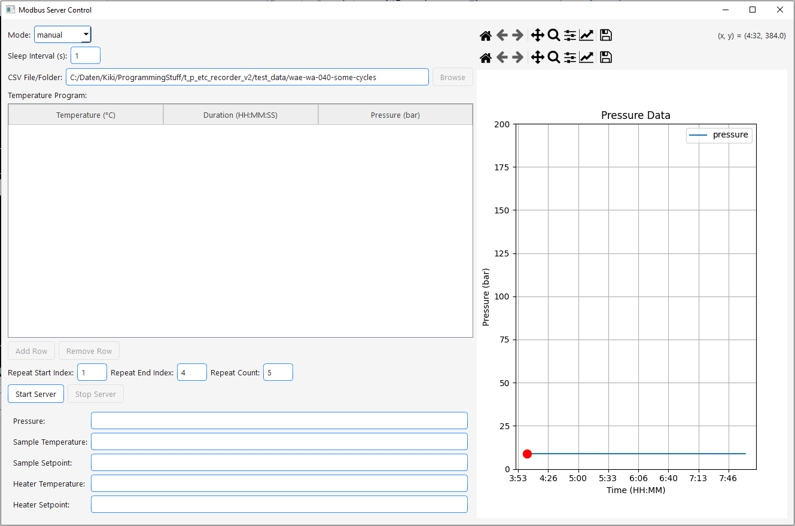
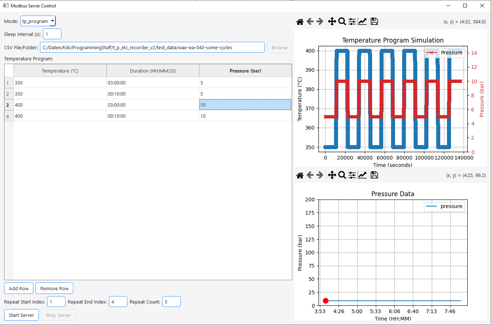
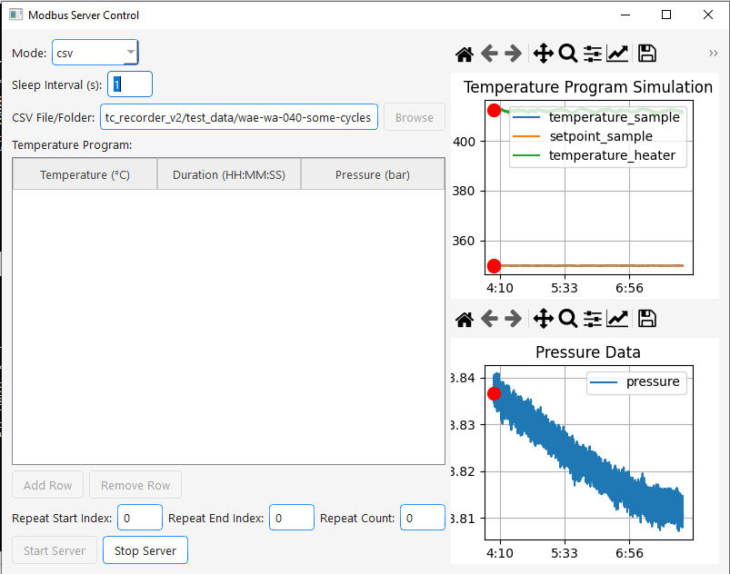

site_name: Dicon Simulator

Available via the view menu of the main window and most likely the buggiest user interface available in this program:

Though the visual appearance of the simulator is admittedly very poor, it is still a powerful tool to simulate a real DICON device to test functionality of the software. 
I'll might rework the UI entirely later. It was written relatively early when I was even more unexperienced in programming than I am now. 
But it does the job!

Once started via *Start Server* the simulator will act as a simulated modbus device which the main window will read from. 
Switch from the real port to the simulated one will 
happen automatically when pressing *Start Server".

You have the following options to simulate temperature and pressure data:

1. **Manual mode**
    - In manual mode you can enter Pressure, Sample Temperature, Setpoint Temperature of sample and heater freely and they will be simulated live. 
    - During simulation you can alter them as you wish
    - 
2. **Program mode**
     - In Program mode you can enter a temperature and pressure program that wil be simulated
     - You can add and remove steps to your program via *Add Row* and *Remove Row*
     - Then enter temperature and pressure values as well as holding times in the table. 
     - Choose a starting end ending step (the parts of the tp-program that should be executed repeatedly) and the amount of repitions.
     - When clicking *Start Server* the temperature program will be executed.
     - A plot of the according temperature program appears in the right plot window
     - 
3. **CSV mode**
     - CSV mode can be used to simulate old measurement data. Just select a folder containing temperature and pressure curves or a single file you would like to simulate and press *Start Server*.
     - The temperature and pressure of the currently simulated file will be plotted on the right side. 
     - By decreasing/increasing sleeping interval you can accelerate/slow down the simulation. 
     - !!! info
         - Your .csv file should have the following structure to work with the simulator:
         -  Column names should be (!in this order): 'SampleTemp',
             'HeaterTemp', 'Pressure', 'TShouldSample'
         - Please dig through the code at the bottom of this page for deeper inside
     - 

``` python


#Snippet of CSVReaderForProgramSimulation 
#located at src/recorder_app/gui/simulation/dicon_simulator_v2.py
def read_and_process_csv(self):
        df = pd.DataFrame()
        file_path = os.path.join(self.csv_file_path, self.file_name)
        # Using low_memory can reduce memory overhead in some cases.
        df = pd.read_csv(file_path, low_memory=True)
        df = self._process_csv_sheets(df=df)
        return df

def _process_csv_sheets(self, df):
    df = df.copy()
    df['Time'] = df['Time'].apply(self._correct_time_format)
    df['Time'] = pd.to_datetime(df['Date'] + ' ' + df['Time'])
    df = df.rename(columns={'Time': TableConfig.TPDataTable.time})
    df[TableConfig.TPDataTable.time] = df[TableConfig.TPDataTable.time].dt.tz_localize(local_tz, ambiguous='NaT')
    df = df.dropna(subset=[TableConfig.TPDataTable.time])
    df = df.drop('Date', axis=1)
    df = df.rename(columns={'SampleTemp': 'temperature_sample',
                            'HeaterTemp': 'temperature_heater',
                            'Pressure': 'pressure',
                            'TShouldSample': 'setpoint_sample'})
    df['setpoint_heater'] = None
    new_df = df[['time', 'pressure', 'temperature_sample', 'setpoint_sample', 'temperature_heater', 'setpoint_heater']]
    return new_df
```
