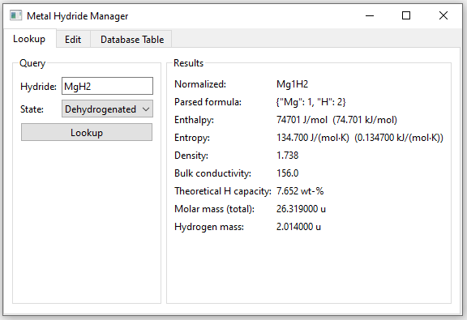
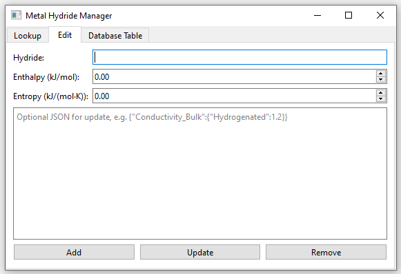
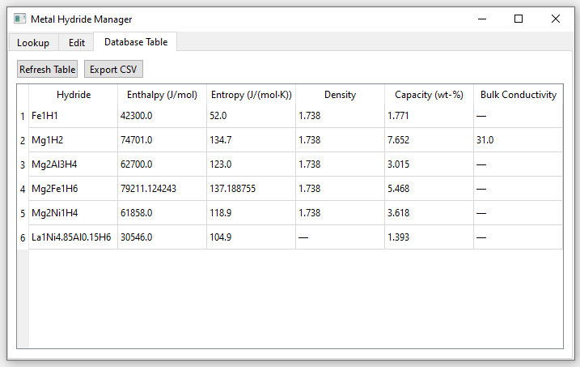

site_name: Hydride Handler

From here you can manage all hydrides in the database. You can add new ones and remove or modify existing ones.

In the Lookup tab you can enter a hydride name and if it is stored in the database all available information of it will be displayed like in the shown example:

In the Edit tab you can update custom columns in the hydride database. (Wouldnt recommend to use this for updating. It is more or less outdated garbage. Better just add new hydrides here and then directly go to the Database Table tab or use it if you want to delete a hydride from the database)

In the Database Table tab all hydrides stored in the database are shown in a table:

- If you would like to alter information just click on the field you would like to change (double click) and enter the value. The database then will be updated automatically
