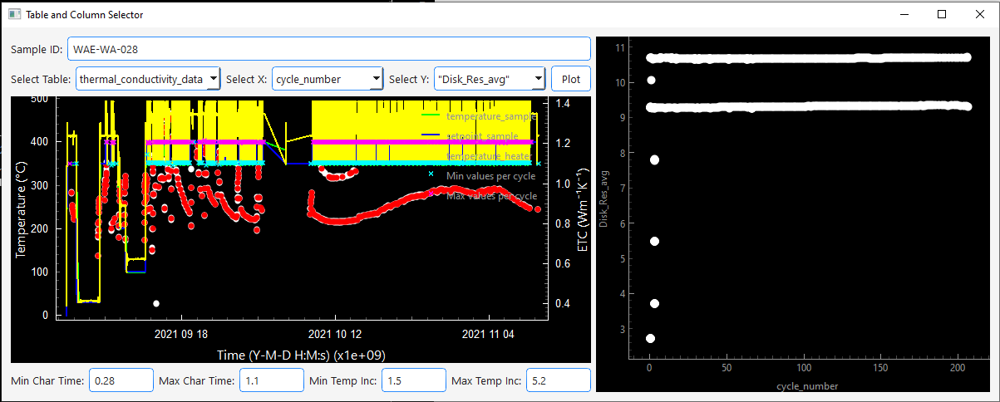

site_name: Plot Individualizer

The plot individualizer allows you to create custom plots from all database tables.
!!! info 
    There are no checks for numerical columns and stuff. You have to decide yourself which columns can be plotted and which not

- Start by entering a sample ID and wait till the whole test is loaded. 
- Then  select a [database table](../database/database_tables.md) 
  from which you would like to plot data. 
- Next select which column should be x and which y
- Zoom in the left plot to select the time frame from which you would like to plot the data. 
- When pressing *Plot* the custom plot appears on the right side. 
