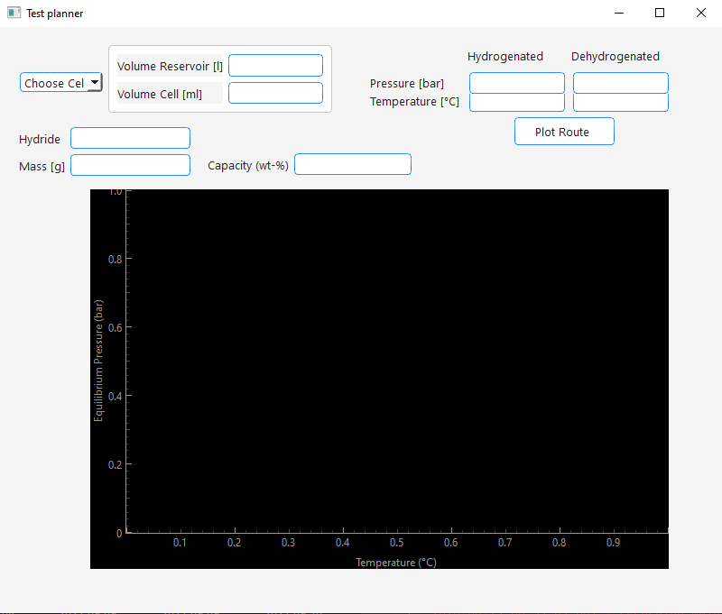
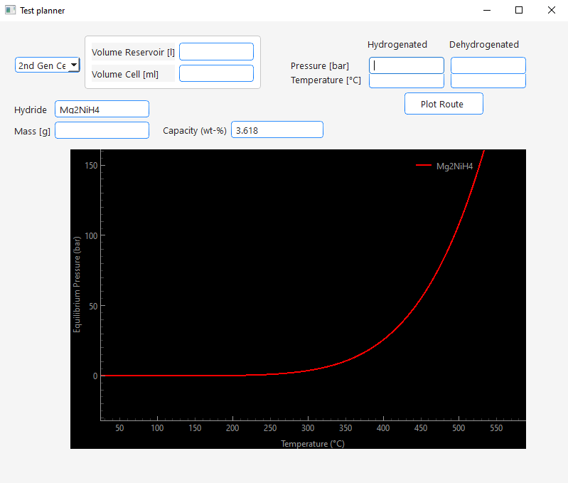
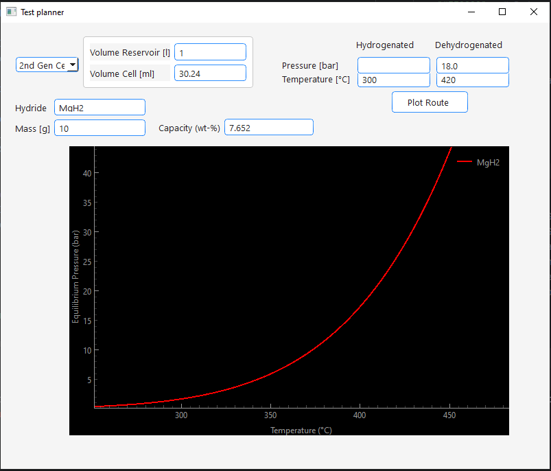
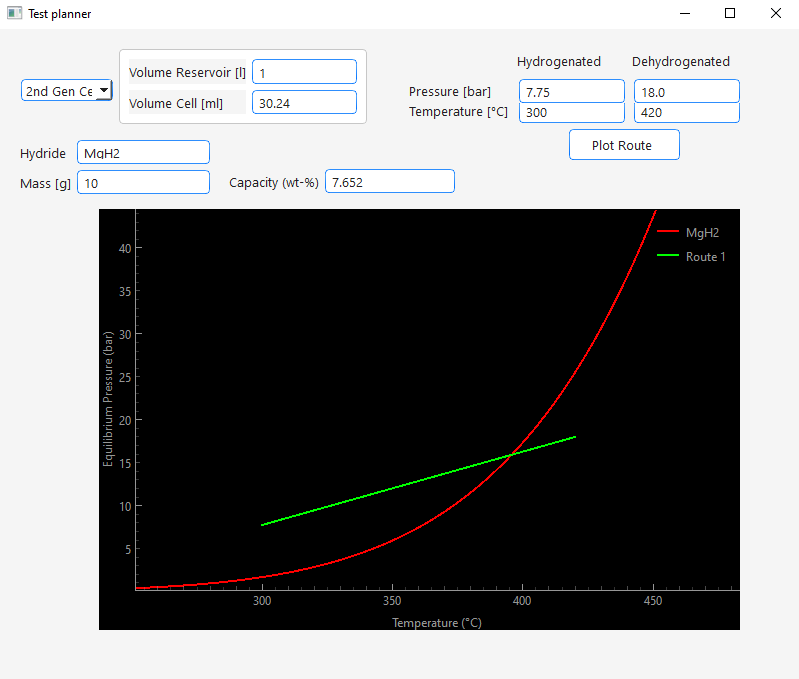
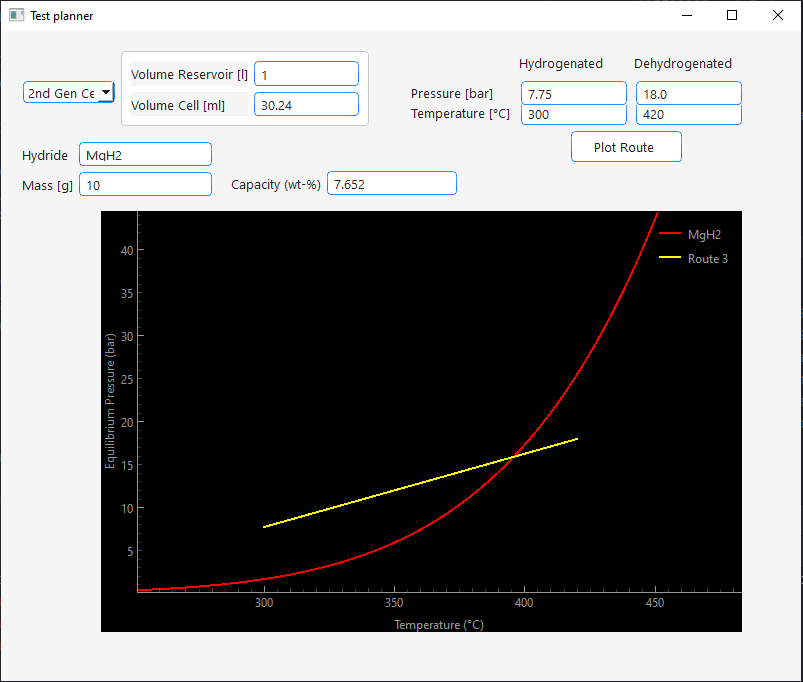
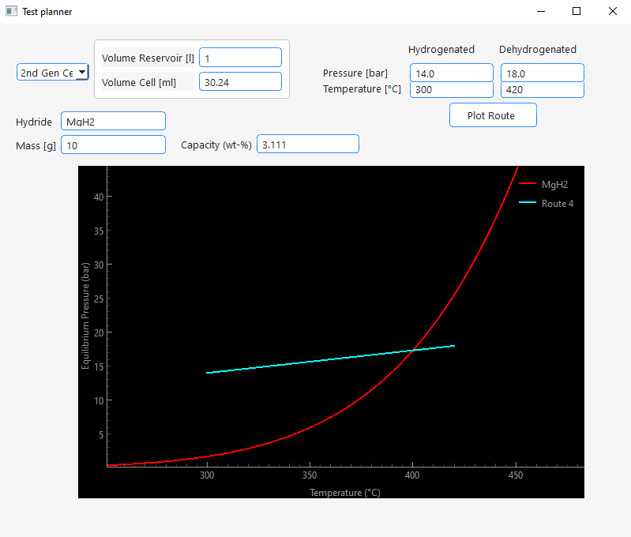

site_name: Test Planner

Via the view menu you can access the *Test Planner* :

It is a tool that helps the user finding proper conditions for a cycle test. 
It comes with the following features: 

1. Plotting of the equilibrium pressure curve of a metal hydride based on enthalpy and entropy values stored in the [Metal Hydride](../database/database_tables.md) database table
    - For this a hydride can be entered into the *Hydride* text edit field. 
      If the hydride is stored in the database the equilibrium pressure 
      curve will be plotted. In the *Capacity* edit field the theoretical hydrogen capacity of the hydride will be displayed.
    - 
2. Estimation of the pressure difference based on the theoretical capacity, sample mass, setup geometry and starting conditions.
    - To estimate pressure differences that would occur during your cycling test, do the following:
      - Enter your hydrogen reservoir volume under "Volume Reservoir" in liter
      - Enter the volume of your sample chamber under "Volume Cell" in milliliter
      - Enter your sample mass under *Mass* in gramm. 
      - Now enter the temperatures you would like to use for hydrogenation and dehydrogenation under *Temperature* in °C
      - If you have more realistic values than the theoretical hydrogen capacity of the hydride enter it under *Capcity* in mass percent.
      - When you start in hydrogenated state and would like to know how much the pressure would increase as result of the dehydrogenation enter your starting pressure under *Pressure* **Hydrogenated** in bar.
        When you start in dehydrogenated state and would like to know how much the pressure would decrease as result of the hydrogenation enter your starting pressure under *Pressure* **Dehydrogenated** in bar.
      - Press *Plot Route*. 
      - The calculated pressure will be displayed in the other empty +Pressure* edit field
        and the plot will update with the according route. 
      - Now you can directly see relative to the equilibrium pressure if your cycling conditions would work. 
      - If you want to test different conditions make sure to delete the calculated pressure before plotting the next route. If both pressure edit fields are filled with values the program will calculate the hydrogen capacity based on the pressure difference and display it in the *Capacity* edit field.
      - **Some examples:
        - **Calculation of pressure drop due to hydrogenation:**
          - 
          - 
        - **Calculation of pressure increase due to dehydrogenation:**
          - 
          - 
        - **Calculation of capacity from pressure differences:**
          - 
