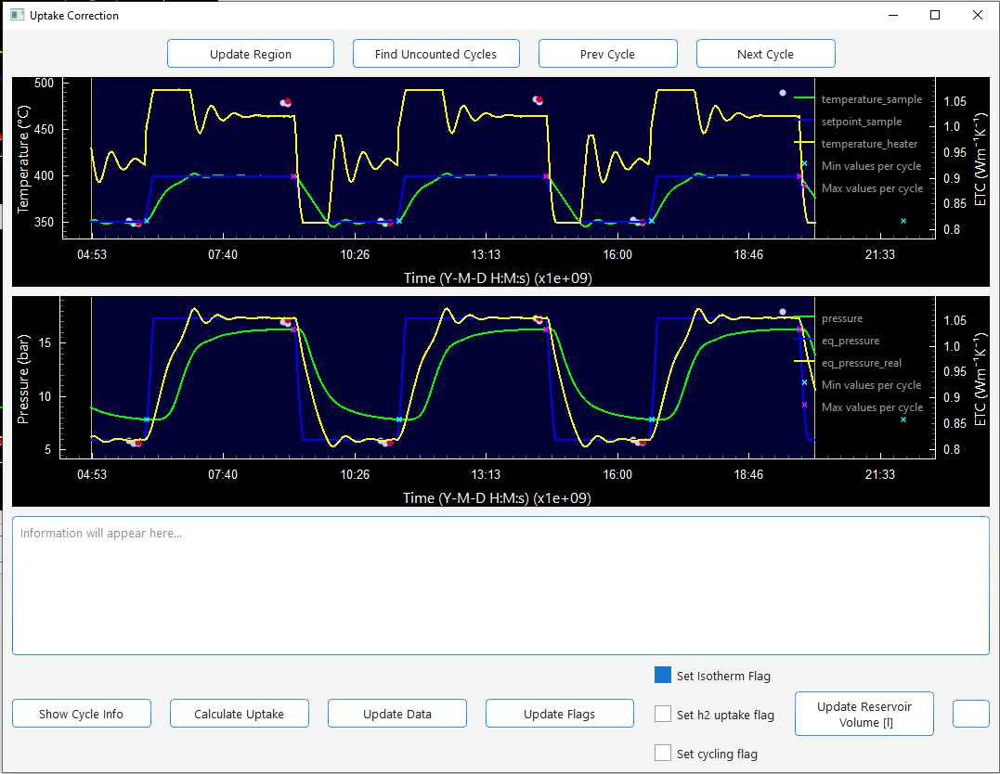

site_name: Uptake Correction

To understand whats happening here you need to be familiar with the 
[Main Window](../main_window.md)

Every common mistake that could happen during operation can be corrected in the 
uptake correction window. If you need more custom modifications you can always query the database directly with a tool of your choice or extend the underlying code. 
When you start it via the view menu the currently visible data (left plots) will be plotted in a seperate window:

- This plot windows can be used to explore the whole data 
set just like the left plots in the main window. 

- You also see the region box in the plot. The box can be used to select data precisely by moving the boarders of the box. 
If you loose the box while exploring simply press *Update Region* to reset the region to the currently visible area. 

- When you press *Find Uncounted Cycles* the program looks through the data of the sample to find cycles in which no hydrogen uptake/release
  could be calculated and then updates the plot to the first cycle where no uptake data could be found. 
- Then you can select the pressures that should be used for the uptake calculation by altering the region box.
- When you press *Calculate Uptake* the hydrogen uptake/release for this area is calculated. 
- When pressing *Update Data* all database tables will be updated with the calculated hydrogen uptake/release for that cycle. 
- When you press *Update Flags* the whole database will be updated with the flags like selected on the right side. 
- The same happens if you click *Update Reservoir Volume* for the reservoir volume column in all tables for the selected time frame with the value entered in the right edit field. This only becomes necessary when you switch reservoirs mid-test. 

