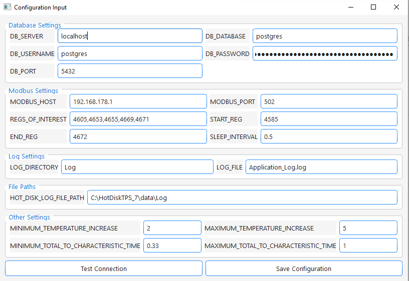
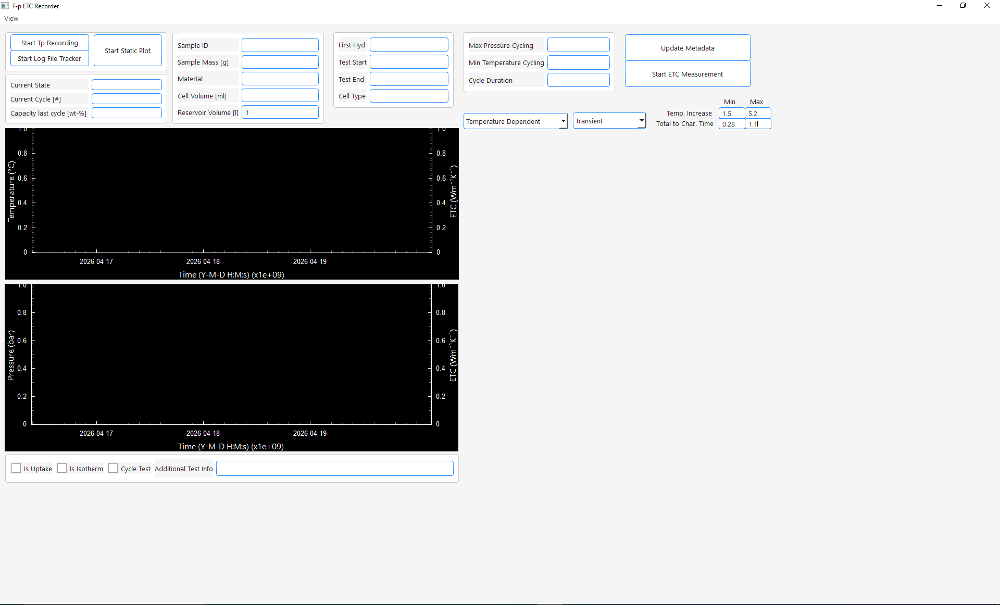

site_name: Configuration Creation

## Configuration

On first startup of ``Scripts/main.py`` the configuration creator 
opens:



1. **Database Settings:**
    - All inputs here can be edited later in the main window by opening the config creator over the view menu.
    - First enter your database credentials and password.  

2. **Modbus Settings:**
    - Modbus Host (IP address of your device) and Port are needed to connect to the device.
    - REGS_OF_INTEREST (comma separated) are the registers the recorder will read from your device. They should **(in this order !!)** represent the following data columns:

    | # | Register in example picture | Column |
    |--:|----------------------------:|--------|
    | 1 | 4605 | Pressure |
    | 2 | 4653 | Sample Temperature |
    | 3 | 4655 | Setpoint Sample Temperature |
    | 4 | 4669 | Heater Temperature |
    | 5 | 4671 | Setpoint Heater Temperature |

    - Note: For the Jumo DICON touch, data is stored in the selected register and the following register.

    - Conversion happens like:
      (See Code Block at bottom of the page)

3. **Logging Settings**
    - Define a folder and file nam to store the application logs. The file name will be extended by date and time
   
4. **Hot Disk Log File Folder**
    - The application tracks the *Hot Disk Thermal Constants Analyzer* log file 
      folder to find exported thermal conductivity data as soon as its exported from the *Thermal Constants Analyzer*
      Standard folder path is given. Should be the same one for you. Otherwise look in your hotdisk installation where the logs are stored

5. **Other Settings**
    - Enter limiting parameters for valid conductivity measurements. Given by Hot Disk user manual (Can be edited also while recording)

6. **Test Connection and Save**
    - Click test connection. If no errors show up click save configuration.

7. **Main Window**
    - After saving your configuration the necessary database tables should be created automatically and the main window should open"
      
    - Nice. Everything works.
    - To start a test continue with 
      [Start New Test](../../user_manual/getting_started/create_new_test.md)


``` {#conversion .python}
def _unpack_to_df(self, regs):
    values = []
    for i in range(0, len(regs), 2):
        raw = struct.pack('>HH', regs[i+1], regs[i])
        values.append(struct.unpack('>f', raw)[0])
    cols = [
        self.table.pressure,
        self.table.temperature_sample,
        self.table.setpoint_sample,
        self.table.temperature_heater,
        self.table.setpoint_heater
           ]
```
