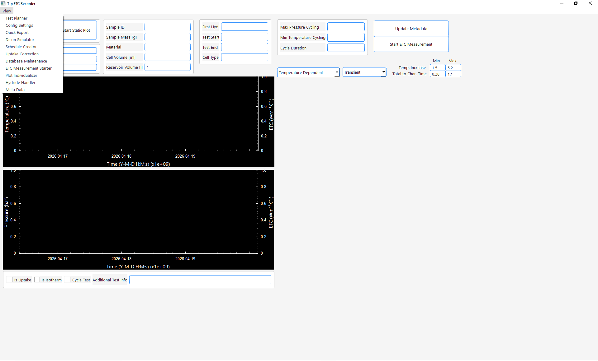
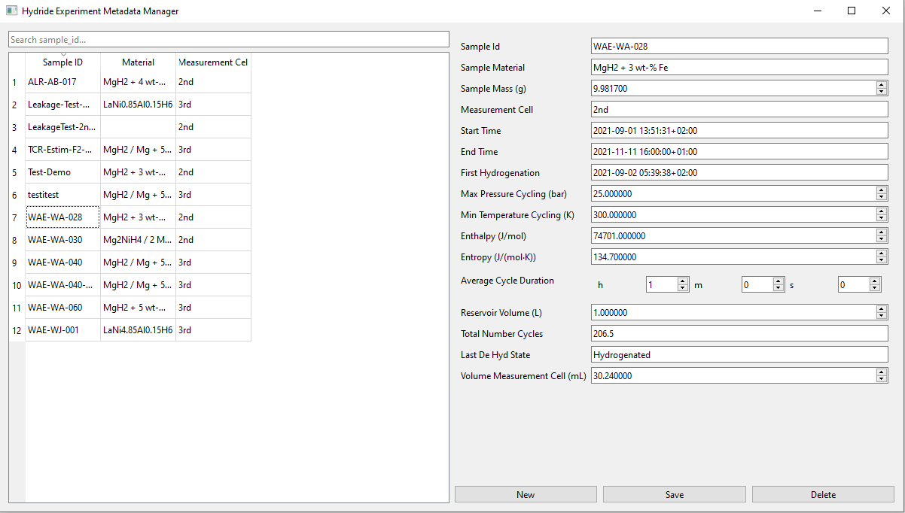

site_name: Write New Sample Meta Data into Database
## Create a meta data entry in the database

1. **Open the Meta Data Handler GUI**
    - Click **view** and select **Meta Data**

2. **Click New**

3. **Input meta data**
    - *Recording will break if the following values are not given before test start:*
        1. *Sample id*: Can be an arbitrary string. Used to identify your sample
        2. *Sample Material*: Must exist in the [Metal Hydride database](../../user_manual/database/database_tables.md) table
            - If you enter a new material make sure you enter the hydrogenated form (Important for determination of theoretical H2-Uptake) and give a value for enthalpy and entropy (Important for determination of dehydrogenation state)
            - Additions like "+ 4 wt-% Fe" etc. are allowed even if not explicitly stored in database and will simply be ignored for calculations. They are for your own orientation
        3. *Max Pressure Cycling* and *Min Temperature Cycling*. Both are relicts from older version and will be removed sooner or later. For now enter a high maximum and a low minimum value
        4. *Average Cycle Duration*: Should be smaller than half your actual cycle duration
        5. *Reservoir Volume*: Size of your hydrogen reservoir you use for cycling 
        6. *Volume Measurement Cell*: Volume of your sample chamber
    - *Last De Hyd* State is optional. Was always dehydrogenated in my case. Never tested if it works starting with Hydrogenated. However, only exactly those 2 strings are valid inputs: Hydrogenated, Dehydrogenated
    - **Leave all other input fields empty!**. Their value will be determined automatically while recording. They are just editable in case you want to make changes on the meta data later in the test without querying the database
 4. **Click Safe**
    - Your tests' meta data is then stored in the [Meta Data Table](../../user_manual/database/database_tables.md)
    - You can close the Meta Data GUI and continue in the [Main Window](../main_window.md)
   

