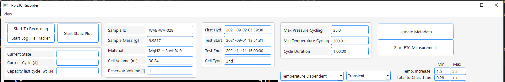
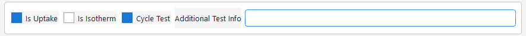
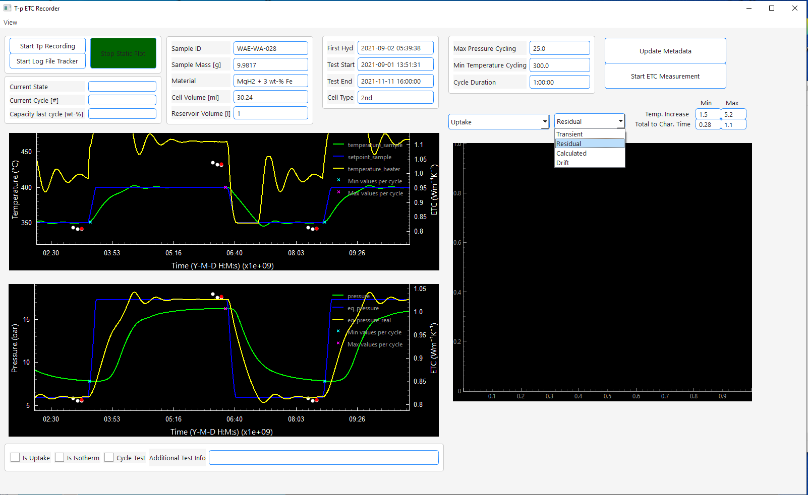
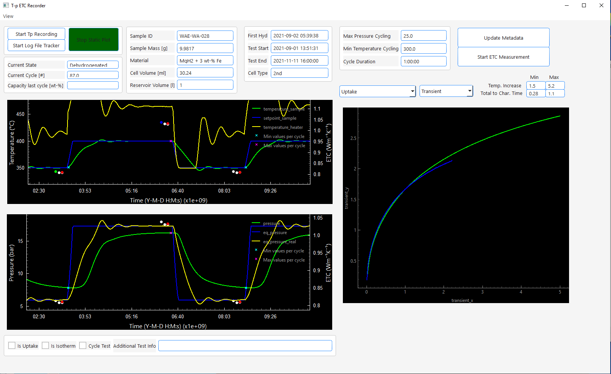
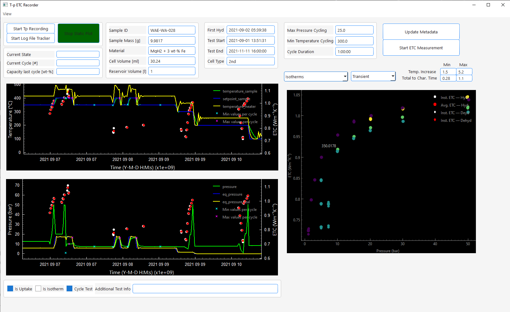

site_name: Main Window Usage

## The Main Window
This window opens when you run:
``` bash 
python Scripts/main.py
```


It serves as the main user interface from which all (finished) functionalities of the software can be accessed. Tests can be selected by entering their sample id in the *Sample ID* edit field.  


Once done the sample's meta data will be loaded from the database and 
filled into the text edit fields:


The user now has the following options:

1. **Start Tp Recording / ETC Data Recording**
    - When clicking on *Start Tp Recording* connection to the configured modbus device will be established using the host and port defined in the 
      [configuration](getting_started/config_creation.md). Data will be read from the device, the equilibrium pressure at the current temperature and the setpoint temperature calculated and all data written into the temperature and pressure data table in the database. 
      The plot windows on the left side will display this data live
    - When clicking on *Start Log File Tracker* the log file of the **Thermal Constants Analyzer** 
      defined in [configuration](getting_started/config_creation.md) will be tracked for changes. 
      Whenever a .xlsx file is exported from the **Thermal Constants Analyzer** the software will notice it and import all content from the .xlsx file into the 
      [Thermal Conductivity Tables](database/database_tables.md) in the database. Once done the thermal conductivity values will be included in the live plots on the left side.
      Generally speaking: when this is activated everytime you export thermal conductivity data from the **Thermal Constants Analyzer 7.6** in .xlsx format this data will be 
      automatically imported into your **PostgreSQL** database. Quite a handy feature one might say.
    - During the recording whenever a cycle is detected the text edit fields on the left side show the current de-/hydrogenation state, cycle number and the uptake of the last half cycle.
    - One cycle is always considered to be a full hydrogenation and a full dehydrogenation. So hydrogenated states will always be labeled as increments of 0.5 + n where n is full number. Dehydrogenated states will be n where n is a full number. So in example after filling dehydrogenated powder cycle # will be 0. After the first hydrogenation 0.5 and after first dehydrogenation 1 and so on.
    - When you finished recording either press **Stop TP Recording** and **Stop Log File Tracking** or just close the main window.
2. **Start Static Plot**
    - Loads the temperature, pressure and thermal conductivity 
      data from the corresponding [database tables](database/database_tables.md) and visualizes them in the left plot windows (*top temperature, bottom pressure, ETC in both plots right y-axis*)
   
!!! info 
    In both modes the plots are interactive, but database reloads and selection (via clicks) is only performed if you interact with the top plot. There are several reasons for this but to conclude I was a lazy programmer. Maybe in the future I will enable interactivity for the bottom plot as well. 
    However, you can zoom in the bottom plot or click on points, but it will do nothing. This is not a bug, it is intended. If you want data to reload zoom in the top plot please.

- For the conductivity data a minimum/maximum total temperature increase and 
total to characteristic time can be set via the edit boxes on the right side.
 You will only see data in the plots that are within those limits. 
(I assume you know what these values are. If not just leave as is)


!!! info
    In the following I will describe all functionalities that the main window offers (without including the other windows available via the view menu).
    Those work for both modes (Tp Recording / ETC Data Recording and Static Plot) with one exception. 
    The checkboxes *Is Uptake*, *Is Isotherm* and *Cycle Test* as well as the edit field *Additional Test Info* only affect data while recording, not data in static plot

## Checkboxes, Interactivity, Plotting
###Checkboxes

We will start with the features that are exclusive for the recording mode. They will affect the data you are measuring directly like described: 

- While recording it is important to understand what happens when you mark the following checkboxes located under the left plot windows:

- 

  - **Additional Test Info** can be an arbitrary combination of characters. All data recorded will have this string in the corresponding database tables in the column "test_info".
  - **Is Uptake**:
    - When **Is Uptake** is checked the all the data recorded will be respected for calculation of the released/absorbed amount of hydrogen.
      For test performance this means you should uncheck this always when you perform manual alterations of the pressure and check it otherwise. 
    - **Cycle Test**: when checked the cycle counting detection is active. When the software realizes that the pressure crosses the equilibrium pressure it will start to alter 
      the cycle number by 0.5 and calculates the released/absorbed amount of hydrogen of the last half cycle. 
    - **Is Isotherm**: when checked the program labels the currently collected data as isothermal measurements. This is important for the visualization and export of the data. 
    
    - !!! info
          - For all checkboxes blue means checked and white means unchecked    
          - In the corresponding database tables the checkboxes are represented by boolean values where 
            true means checked and false means unchecked. For plotting and exporting they are used as identifiers.
    

### Interactivity
#### Zooming
By default every second 2 data points will be recorded evaluated and stored in the database. 
At the same time once a second data will be read from the database for the visualization. 
To prevent flooding the memory the visualization is limited to
a maximum of 5000 data points. The same is true for the static plot mode. 
When a complete test is loaded from the database this can lead to poor resolution. So every time
you hover about the x-axis of the top plot and zoom in or out 5000 data 
points in the currently visible time period will be fetched from the database
and the plot updates. Though the database is partitioned by the sample id you might realize after recording/deleting a large amount of data
that the zooming feels sluggish. This is an issue with the loading speed that can be fixed by running 
the database maintenance available via the view menu of the main window:


Just click *Run VACUUM/ANALYZE/REINDEX* and wait for it to finish (can take several minutes)

#### Accessing the measurements behind the conductivity data

When exploring your data your window might looks like this: 


As you see the thermal conductivity measurement results are plotted as white dots and their average value of all measurements in the same state are plotted as red dots.
As you might know those dots are not the actual measurements but their results. Sometimes it can become useful to look at the underlying measurements, their fit, residual or the drift measurement taken before the measurement.  

If you want to do that, you can choose the type from the right dropdown menu. When chosen you can click on a measurement result in the left top plot window and the data for that measurement will be plotted on the right side (in the same color the dot changes to).
Selection of multiple conductivity measurements is allowed by just clicking on another point. 
The data will be visualized like in the following example for the transient readings:



To clear the right plot just choose another data type from the right drop down menu.

#### Common Plots

##### Pressure dependent / Isotherms

The ETC of porous media (e.g. metal hydride powder beds) shows a pressure dependency according 
to the Smoluchowski effect. To visualize the pressure dependency you have to options.  
On the left drop down menu you can select *Pressure Dependent* or *Isotherms*. 
With both options the currently visible ETC data (in the left plot windows) will be plotted over the pressure at measurement time
in the right plot window. The main difference is the following: 

- *Pressure Dependent*: This will respect all conductivity values that are visible in the left plot window
- *Isotherms*: This will only respect those conductivity values that are marked as isothermal measurements during the recording by activating the 
   **Is Isotherm** checkbox 

For better imagination here is an example of the resulting plot:



The result is pretty basic. 
!!! info
    I usually only use those plots for orientation. 
    In the future I would like to add features like proper 
    labeling of the temperature for each isotherm and exporting 
    the data to origin to receive proper publication-ready 
    plots without extracting the data from an extra export. 

The other available options to plot thermal conductivity are: 

- **Temperature Dependent**: Plots the ETC data temperature dependent.
- **Cycle Dependent**: Plots the ETC data (only which is labeled via *Cycle Test* checkbox) over the de-/hydrogenation cycles

Via *Uptake* you can plot the hydrogen uptake/release of the currently visible data (left plot) over the cycles in the right plot window

### Overview about other windows
Via the view menu you have access to multiple windows: 


1. **[Test Planner](all_windows/test_planner.md)**
2. **[Config Settings](getting_started/config_creation.md)**
3. **[Quick Export](all_windows/quick_export.md)**
4. **[Dicon Simulator](all_windows/dicon_simulator.md)**
5. **[Schedule Creator]()**
6. **[Uptake Correction]()**
7. **[Database Maintenance]()**
8. **[ETC Measurement Starter]()**
9. **[Plot Individualizer]()**
10. **[Hydride Handler]()**
11. **[Meta Data]()**
